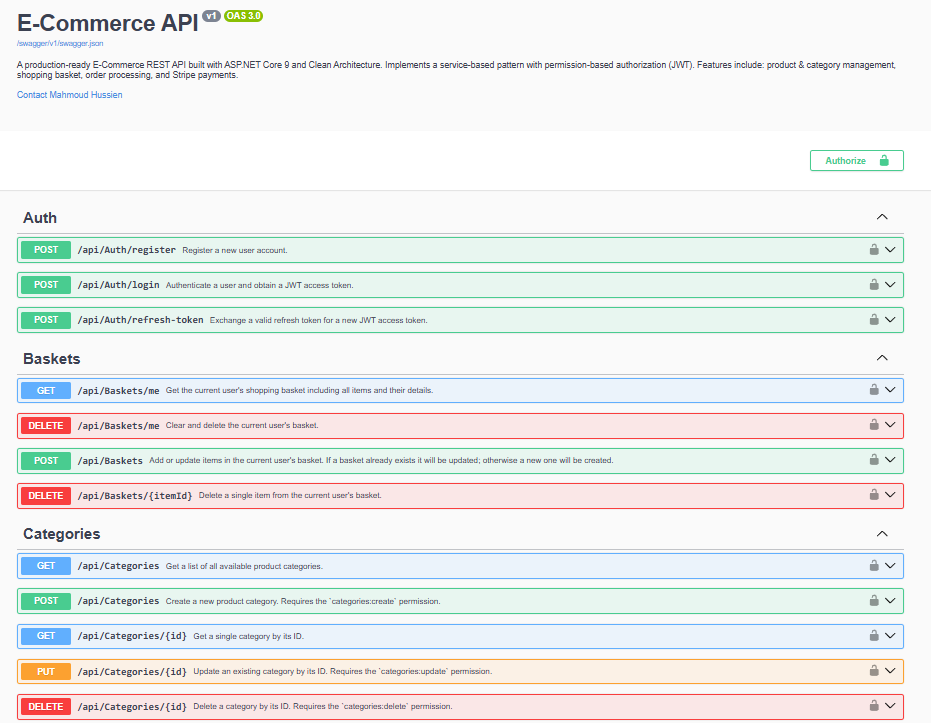
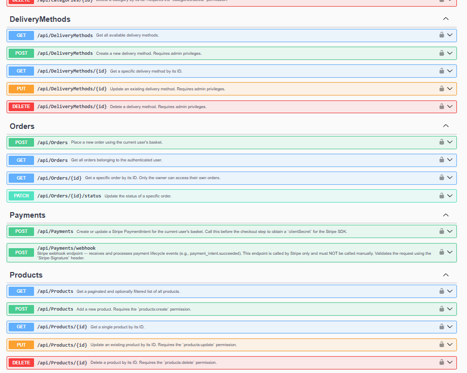

<div align="center">

# 🛒 E-Commerce REST API

**A production-ready, Clean Architecture E-Commerce backend built with ASP.NET Core 9**

[](https://dotnet.microsoft.com/)
[](https://learn.microsoft.com/en-us/aspnet/core/)
[](https://learn.microsoft.com/en-us/ef/core/)
[](https://redis.io/)
[](https://stripe.com/)
[](https://swagger.io/)

</div>

---

## 📋 Table of Contents

- [Overview](#-overview)
- [Architecture](#-architecture)
- [Features](#-features)
- [Tech Stack](#-tech-stack)
- [Project Structure](#-project-structure)
- [API Endpoints](#-api-endpoints)
- [Permission System](#-permission-system)
- [Getting Started](#-getting-started)
- [Configuration](#️-configuration)
- [Health Checks](#-health-checks)

---

## 🌟 Overview

A fully-featured, production-ready E-Commerce REST API implementing **Clean Architecture** principles with a clear separation of concerns across four distinct layers. Designed for scalability, testability, and maintainability.

**Key highlights:**
- 🏛️ Clean Architecture (Core → Application → Infrastructure → API)
- 🔐 JWT Authentication with Refresh Tokens
- 🛡️ Fine-grained Permission-Based Authorization
- 🛒 Redis-backed Shopping Basket
- 💳 Stripe Payment Integration with Webhooks
- 📦 Unit of Work & Generic Repository patterns
- ✅ FluentValidation input validation
- 📊 Health Checks (SQL Server + Redis)
- 📄 Swagger / OpenAPI documentation

---

## 🏛️ Architecture

```
┌─────────────────────────────────────────┐
│              E-Commerce API             │
│          (Presentation Layer)           │
│   Controllers · Middleware · Swagger    │
└────────────────────┬────────────────────┘
                     │ depends on
┌────────────────────▼────────────────────┐
│           E-Commerce.Application        │
│           (Business Logic Layer)        │
│  Services · Validators · Abstractions   │
└────────────────────┬────────────────────┘
                     │ depends on
┌────────────────────▼────────────────────┐
│             E-Commerce.Core             │
│             (Domain Layer)              │
│   Entities · Enums · Interfaces         │
└─────────────────────────────────────────┘
                     ▲
                     │ implements
┌────────────────────┴────────────────────┐
│         E-Commerce.Infrastructure       │
│         (Data Access Layer)             │
│  EF Core · Redis · JWT · Stripe · Repos │
└─────────────────────────────────────────┘
```

---

## ✨ Features

| Module | Features |
|---|---|
| 🔐 **Authentication** | Register, Login, Refresh Token, JWT Bearer |
| 🛒 **Basket** | Get, Add/Update, Delete basket, Remove single item |
| 📦 **Products** | Full CRUD, image upload, pagination & filtering |
| 🏷️ **Categories** | Full CRUD with permission guards |
| 📋 **Orders** | Create, list, get by ID, update order status |
| 🚚 **Delivery Methods** | Full CRUD for admin management |
| 💳 **Payments** | Stripe PaymentIntent, webhook for status sync |
| 🔑 **Authorization** | Roles + fine-grained permission claims per endpoint |
| 🚦 **Rate Limiting** | IP-based limiters, User-based limiters, and Global concurrency protection |
| 📝 **Logging** | Structured logging with Serilog, writing to file & console |

---

## 🛠️ Tech Stack

| Layer | Technology |
|---|---|
| **Framework** | ASP.NET Core 9 |
| **ORM** | Entity Framework Core 9 |
| **Database** | SQL Server |
| **Cache / Basket** | Redis (StackExchange.Redis) |
| **Auth** | JWT Bearer + Refresh Tokens |
| **Payments** | Stripe.net |
| **Validation** | FluentValidation |
| **Documentation** | Swagger / Swashbuckle |
| **Health Checks** | AspNetCore.HealthChecks.SqlServer + Redis |
| **Image Storage** | Local file system (wwwroot) |
| **Logging** | Serilog (Structured Logging) |
| **Rate Limiting** | ASP.NET Core RateLimiter |

---

## 📁 Project Structure

```
E-commerce/
├── E-commerce.Api/                     # Presentation Layer
│   ├── Controllers/
│   │   ├── AuthController.cs
│   │   ├── BasketsController.cs
│   │   ├── CategoriesController.cs
│   │   ├── DeliveryMethodsController.cs
│   │   ├── OrdersController.cs
│   │   ├── PaymentsController.cs
│   │   └── ProductsController.cs
│   ├── Abstraction/                    # Extensions & Exception Handler
│   └── Program.cs
│
├── E-commerce.Application/             # Business Logic Layer
│   ├── Abstractions/
│   │   ├── Authorization/              # PermissionPolicyNames
│   │   ├── Persistence/                # Repository interfaces + IUnitOfWork
│   │   └── Services/                   # Service interfaces
│   ├── Contracts/                      # Request / Response DTOs
│   ├── Errors/                         # Typed domain errors
│   ├── Services/                       # Service implementations
│   └── Validators/                     # FluentValidation validators
│
├── E-commerce.Core/                    # Domain Layer
│   └── Entities/
│       ├── Order/                      # Orders, OrderItem, DeliveryMethod, Status
│       ├── Authorization/              # Permission, PermissionNames, RolePermission
│       ├── Identity/                   # RefreshToken, DefaultIdentityData
│       ├── Product, Category, CustomerBasket, BasketItem
│
├── E-commerce.Infrastructure/          # Data Access Layer
│   ├── Authentication/                 # JWT + Permissions
│   ├── Data/
│   │   ├── Configurations/             # EF Fluent API Configurations
│   │   ├── Migrations/
│   │   └── ApplicationDbContext.cs
│   ├── Repositories/                   # GenericRepository + UnitOfWork
│   └── Service/                        # Auth, Payment, Image services
│
└── tests/
    └── E-commerce.Core.Tests/          # Unit tests (xUnit)
```

---

## 📡 API Endpoints

<div align="center">
  
  
</div>

### 🔐 Auth — `/api/Auth`
| Method | Endpoint | Description | Auth |
|--------|----------|-------------|------|
| `POST` | `/register` | Register a new user | Public |
| `POST` | `/login` | Login and receive JWT + Refresh Token | Public |
| `POST` | `/refresh` | Refresh expired JWT | Public |

### 🛒 Baskets — `/api/Baskets`
| Method | Endpoint | Description | Auth |
|--------|----------|-------------|------|
| `GET` | `/me` | Get current user's basket | 🔒 User |
| `POST` | `/` | Add/update basket items | 🔒 User |
| `DELETE` | `/me` | Clear entire basket | 🔒 User |
| `DELETE` | `/{itemId}` | Remove a single item | 🔒 User |

### 📦 Products — `/api/Products`
| Method | Endpoint | Description | Auth |
|--------|----------|-------------|------|
| `GET` | `/` | Get all products (paginated) | Public |
| `GET` | `/{id}` | Get product by ID | Public |
| `POST` | `/` | Create product | 🔒 `products:create` |
| `PUT` | `/{id}` | Update product | 🔒 `products:update` |
| `DELETE` | `/{id}` | Delete product | 🔒 `products:delete` |

### 🏷️ Categories — `/api/Categories`
| Method | Endpoint | Description | Auth |
|--------|----------|-------------|------|
| `GET` | `/` | Get all categories | Public |
| `GET` | `/{id}` | Get category by ID | Public |
| `POST` | `/` | Create category | 🔒 `categories:create` |
| `PUT` | `/{id}` | Update category | 🔒 `categories:update` |
| `DELETE` | `/{id}` | Delete category | 🔒 `categories:delete` |

### 📋 Orders — `/api/Orders`
| Method | Endpoint | Description | Auth |
|--------|----------|-------------|------|
| `POST` | `/` | Place a new order | 🔒 User |
| `GET` | `/` | Get all orders for current user | 🔒 User |
| `GET` | `/{id}` | Get order by ID | 🔒 User |
| `PATCH` | `/{id}/status` | Update order status | 🔒 `orders:update` |

### 🚚 Delivery Methods — `/api/DeliveryMethods`
| Method | Endpoint | Description | Auth |
|--------|----------|-------------|------|
| `GET` | `/` | Get all delivery methods | Public |
| `GET` | `/{id}` | Get delivery method by ID | Public |
| `POST` | `/` | Create delivery method | 🔒 `deliverymethods:create` |
| `PUT` | `/{id}` | Update delivery method | 🔒 `deliverymethods:update` |
| `DELETE` | `/{id}` | Delete delivery method | 🔒 `deliverymethods:delete` |

### 💳 Payments — `/api/Payments`
| Method | Endpoint | Description | Auth |
|--------|----------|-------------|------|
| `POST` | `/` | Create or update Stripe PaymentIntent | 🔒 User |
| `POST` | `/webhook` | Stripe webhook for order status sync | Public (Stripe-signed) |

---

## 🔑 Permission System

The API implements a **custom claim-based permission system** on top of ASP.NET Core's authorization middleware. Each role is assigned a set of fine-grained permission claims at seeding time.

| Permission | Description |
|---|---|
| `products:read` | View products |
| `products:create` | Create products |
| `products:update` | Update products |
| `products:delete` | Delete products |
| `categories:read/create/update/delete` | Manage categories |
| `orders:read` | View orders |
| `orders:create` | Place orders |
| `orders:update` | Update order status |
| `deliverymethods:read/create/update/delete` | Manage delivery methods |
| `payments:create` | Initiate payments |
| `basket:write` | Manage shopping basket |

---

## 🚦 Rate Limiting

To prevent abuse and ensure high availability, the API implements several Rate Limiting mechanisms without queueing dropped requests, preventing unnecessary server load:

- **IP-Based Limiter (`ipLimiter`)**: Applied to Auth endpoints (`/login`, `/register`, `/refresh`) to prevent brute-force attacks and spam. Limit: **15 requests / 1 minute** per IP.
- **Checkout Limiter (`checkoutLimiter`)**: Applied to high-load write endpoints (`/orders` creation, `/payments`) to prevent spamming the checkout pipeline. Limit: **5 requests / 1 minute** per authenticated user.
- **Basket Limiter (`basketLimiter`)**: Applied to basket modification endpoints. Limit: **30 requests / 1 minute** per authenticated user.
- **Global Concurrency Limiter**: Applied automatically to **ALL** endpoints. Prevents server overload by limiting maximum concurrent requests to **500** (queue limits up to 100 requests).
- **Status Code**: Exceeding the limits will immediately return `429 Too Many Requests`. Clients should implement appropriate retry logic.

---

## 📝 Logging (Serilog)

The system leverages **Serilog** for advanced, structured logging.
- **Console Sink**: Used for real-time monitoring.
- **File Sink**: Daily rolling logs configured in JSON format for easy ingestion by log aggregators (e.g., ELK stack, Seq).
- **Contextual Enrichment**: Logs automatically include Thread IDs, Machine Names, and HTTP request contexts.

---

## 🚀 Getting Started

### Prerequisites

- [.NET 9 SDK](https://dotnet.microsoft.com/en-us/download/dotnet/9.0)
- [SQL Server](https://www.microsoft.com/en-us/sql-server/)
- [Redis](https://redis.io/download/)
- [Stripe Account](https://dashboard.stripe.com/register) (for payments)

### Installation

```bash
# 1. Clone the repository
git clone https://github.com/MahmoudHussien74/E-commerce-App.git
cd E-commerce-App

# 2. Restore dependencies
dotnet restore

# 3. Apply database migrations
dotnet ef database update --project E-commerce.Infrastructure --startup-project E-commerce.Api

# 4. Run the API
dotnet run --project E-commerce.Api
```

The API will be available at `https://localhost:5001` and Swagger at `https://localhost:5001/swagger`.

---

## ⚙️ Configuration

Create or update `E-commerce.Api/appsettings.json`:

```json
{
  "ConnectionStrings": {
    "EcommerceDatabase": "Server=.;Database=EcommerceDb;Trusted_Connection=True;TrustServerCertificate=True;",
    "redis": "localhost:6379"
  },
  "Jwt": {
    "Key": "YOUR_SUPER_SECRET_KEY_AT_LEAST_32_CHARACTERS",
    "Issuer": "EcommerceApi",
    "Audience": "EcommerceApiClient",
    "ExpiryMinutes": 60
  },
  "Stripe": {
    "SecretKey": "sk_test_...",
    "PublishableKey": "pk_test_...",
    "WebhookSecret": "whsec_..."
  }
}
```

> **Note:** For production, store secrets using **Environment Variables** or **Azure Key Vault** — never commit secrets to source control.

---

## 🏥 Health Checks

The API exposes a health endpoint at `/health` that reports the status of all critical dependencies:

```bash
GET /health
```

```json
{
  "status": "Healthy",
  "results": {
    "SQLServer": { "status": "Healthy" },
    "Redis":     { "status": "Healthy" }
  }
}
```

---

## 📄 License

This project is licensed under the MIT License.

---
